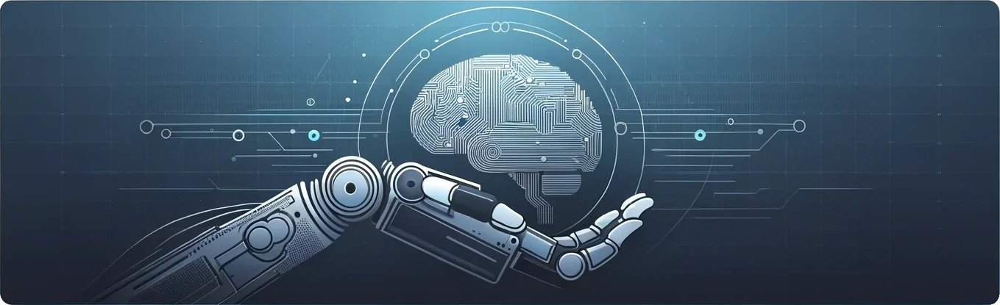

  

Puede acceder a mi currículum haciendo click en el siguiente botón.

    <button style="padding: 10px 20px; background-color: #4CAF50; color: white; border: none; border-radius: 5px; cursor: pointer;" onclick="window.open('../assets/documents/cv.pdf', 'PDFViewer', 'width=auto,height=auto,toolbar=no,scrollbars=yes');">Ver Curriculum</button>
   

También puede ponerse en contacto conmigo a través de los medios disponibles en la sección de la izquierda.
