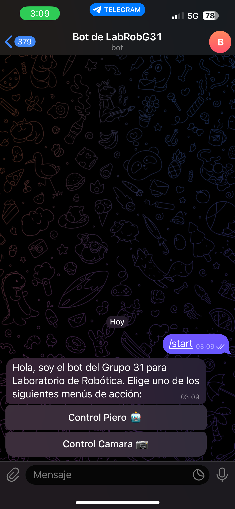
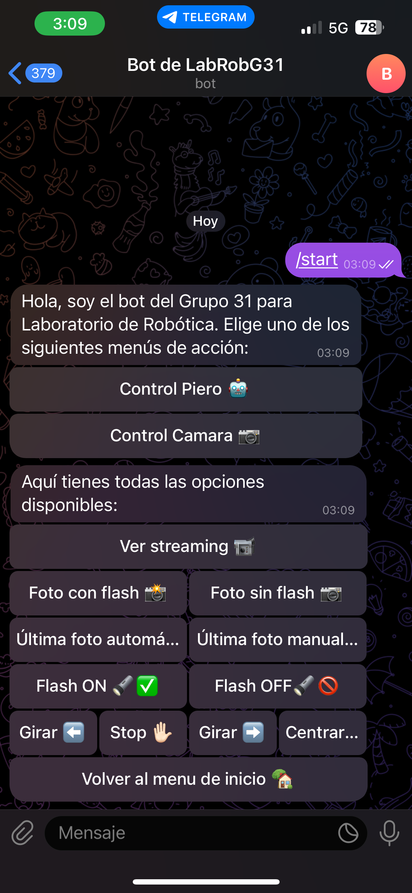

# Objetivo

El siguiente proyecto constituye la implementación de una cámara con un sistema de movimiento integrado, el cuál permite el giro de esta en el plano horizontal en 360 grados. Esta cámara ha sido destinada a dos objetivos principales:

- Como cámara de seguridad para un sistema de domotización de una vivienda. Para acceder a dicho proyecto haga click en el siguiente botón.

  <!-- Botón con estilo -->
  <button class="boton" onclick="window.open('https://dxvidlf.github.io/profile/proyecto/Domotizacion/', '_blank')">Ver proyecto de domotización</button>  
   

- Como sistema de visión en tiempo real para un robot móvil de cinemática diferencial. Para acceder a dicho proyecto haga click en el siguiente botón.

  <!-- Botón con estilo -->
  <button class="boton" onclick="window.open('https://dxvidlf.github.io/profile/proyecto/Piero/, '_blank')">Ver proyecto de robot móvil</button>

Para controlar el sistema de movimiento de la cámara se pueden emplear tres medios:
- Mando Wifi 
- Chat de Telegram
- Dashboard de NodeRed

## Control de la cámara mediante el mando Wifi

El mando Wifi está compuesto principalmente por un par de joysticks y una ESP32 Wroom 32, la cual hace de puente de conexión entre la cámara y los comandos del joystick. El segundo joystick está destinado al control manual del movimiento del robot diferencial mencionado anteriormente. La traducción de movimientos del otro joytsick en comandos para la cámara es la siguiente: 

| Movimiento | Comando |
|-------------|---------|
| Joystick hacia arriba | Activar/Desactivar el LED flash de la cámara |
| Joystick hacia abajo | Llevar la cámara hacia su posición origen |
| Joystick hacia la derecha | Girar cámara hacia la derecha|
| Joystick hacia la izquierda | Girar cámara hacia la izquierda |
| Click en el joystick | Hacer una foto y mandarla a Telegram  |

En el siguiente video se puede ver la cámara moviéndose haciendo uso del mando Wifi. 



## Control de la cámara mediante Telegram y NodeRed

Para el control de la cámara mediante Telegram se ha creado un bot que nos ofrece un completo menú de acciones disponibles. En este sentido, Telegram y NodeRed funcionan al unísono, dado que la gestión de las peticiones realizadas al bot de Telegram son gestionadas mediante la lógica de un flujo implementado en NodeRed, el cual a su vez nos ofrece una completa interfaz de usuario donde podemos controlar por completo todo el sistema de la cámara. 

  <!-- Primera imagen -->
  
  <!-- Segunda imagen -->
  

Además, gracias al uso de MongoDB como base de datos, todas las fotos que tomemos se guardarán para que posteriormente podamos recuperarlas si lo precisamos. 
